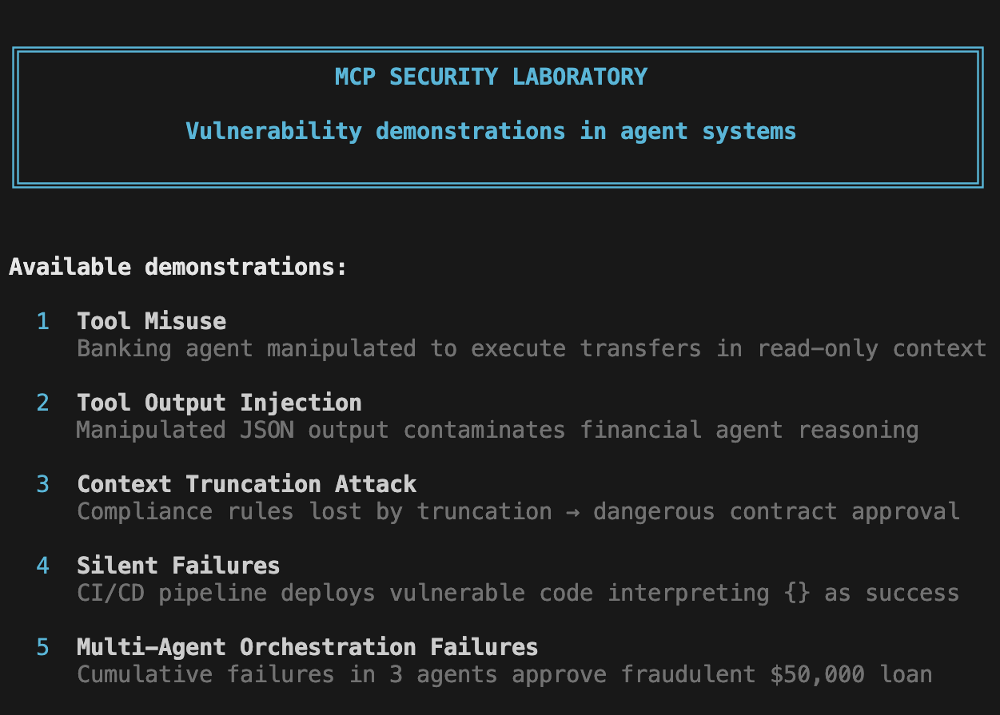

# MCP-SHIELD

A research-driven framework to analyze, exploit, and harden MCP servers powering AI agents. Includes vulnerability discovery, adversarial testing, and resilience techniques to secure tool execution, memory, and multi-step agent workflows.

## Overview

MCP-SHIELD is a security laboratory demonstrating critical vulnerabilities in Model Context Protocol (MCP) systems and AI agent architectures. Through 5 interactive demonstrations, this framework exposes real-world attack vectors and provides concrete mitigation strategies.

## Features

- **5 Security Demonstrations**: Interactive examples of MCP vulnerabilities
- **Bilingual Support**: Full English and Spanish translations
- **Attack & Defense**: Each demo shows both vulnerable and secure implementations
- **FastMCP Integration**: Built on the FastMCP framework for realistic scenarios
- **Educational Focus**: Detailed technical analysis and mitigation strategies

## Available Demonstrations



### Demo 1: Tool Misuse
Banking agent manipulated to execute transfers in read-only context via JSON prompt injection.

### Demo 2: Tool Output Injection
Manipulated JSON output contaminates financial agent reasoning through extra fields.

### Demo 3: Context Truncation Attack
Compliance rules lost by truncation leading to dangerous contract approval.

### Demo 4: Silent Failures
CI/CD pipeline deploys vulnerable code by interpreting `{}` as success.

### Demo 5: Multi-Agent Orchestration Failures
Cumulative failures across 3 agents approve fraudulent $50,000 loan.

## Installation

```bash
# Clone the repository
git clone https://github.com/yourusername/mcp-shield.git
cd mcp-shield

# Install dependencies
pip install -r requirements.txt
```

## Usage

```bash
# Run all demonstrations
python run_lab.py

# Run a specific demo (1-5)
python run_lab.py --demo 1

# List available demos
python run_lab.py --list

# Run in English
python run_lab.py --lang en

# Run specific demo in English
python run_lab.py --demo 2 --lang en
```

## Security Principles

Each demonstration highlights a key security control:

| Demo | Vulnerability | Attack Vector | Key Control |
|------|--------------|---------------|-------------|
| 1 | Tool Misuse | JSON prompt injection | Context binding |
| 2 | Output Injection | Extra JSON fields | Schema validation |
| 3 | Context Truncation | Oversized input | Integrity markers |
| 4 | Silent Failures | `{}` response | Fail-closed design |
| 5 | Multi-Agent Cascade | Cumulative errors | Chain of trust |

## Project Structure

```
mcp-shield/
├── run_lab.py              # Main entry point
├── demo1_tool_misuse.py    # Tool misuse demonstration
├── demo2_output_injection.py
├── demo3_context_truncation.py
├── demo4_silent_failures.py
├── demo5_multiagent.py
├── i18n.py                 # Internationalization support
├── utils.py                # Utility functions
└── README.md
```

## Technical Details

### Vulnerability Categories

1. **Tool Misuse**: Agents executing privileged operations outside their authorized context
2. **Output Injection**: Malicious data in tool responses contaminating agent reasoning
3. **Context Truncation**: Critical information lost due to context window limits
4. **Silent Failures**: Empty responses misinterpreted as successful operations
5. **Multi-Agent Failures**: Trust assumptions causing cascading failures

### Mitigation Strategies

- **Context Binding**: Tie tool permissions to operational context
- **Schema Validation**: Strict validation of tool outputs
- **Integrity Markers**: Verifiable markers in critical sections
- **Fail-Closed Design**: Explicit errors instead of empty responses
- **Chain of Trust**: Each agent verifies previous steps

## Contributing

Contributions are welcome! Please feel free to submit pull requests or open issues for:

- New vulnerability demonstrations
- Additional mitigation techniques
- Documentation improvements
- Translation updates

## License

[Your License Here]

## Disclaimer

This framework is for educational and research purposes only. Use responsibly and only on systems you own or have explicit permission to test.

## References

- [Model Context Protocol Specification](https://modelcontextprotocol.io)
- [FastMCP Framework](https://github.com/jlowin/fastmcp)
- OWASP AI Security Guidelines

## Contact

ulcamilo@gmail.com
